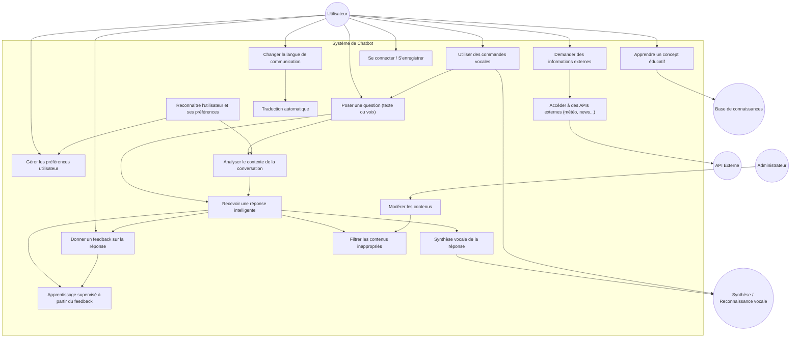

# diagramme-cas-d-utilisation-pfa

```mermaid
%% Diagramme de cas d'utilisation détaillé pour un chatbot généralisé
graph TB
    Utilisateur((Utilisateur))
    Administrateur((Administrateur))
    API_Externe((API Externe))
    Base_Connaissances((Base de connaissances))
    Système_Vocal((Synthèse / Reconnaissance vocale))

    subgraph Système de Chatbot
        UC1["Poser une question (texte ou voix)"]
        UC2["Recevoir une réponse intelligente"]
        UC3["Donner un feedback sur la réponse"]
        UC4["Changer la langue de communication"]
        UC5["Utiliser des commandes vocales"]
        UC6["Demander des informations externes"]
        UC7["Apprendre un concept éducatif"]
        UC8["Se connecter / S'enregistrer"]
        UC9["Gérer les préférences utilisateur"]
        UC10["Modérer les contenus"]
        UC11["Analyser le contexte de la conversation"]
        UC12["Reconnaître l'utilisateur et ses préférences"]
        UC13["Synthèse vocale de la réponse"]
        UC14["Filtrer les contenus inappropriés"]
        UC15["Accéder à des APIs externes (météo, news...)"]
        UC16["Apprentissage supervisé à partir du feedback"]
        UC17["Traduction automatique"]
    end

    Utilisateur --> UC1
    Utilisateur --> UC4
    Utilisateur --> UC5
    Utilisateur --> UC6
    Utilisateur --> UC7
    Utilisateur --> UC8
    Utilisateur --> UC9
    Utilisateur --> UC3

    UC1 --> UC2
    UC1 --> UC11
    UC2 --> UC3
    UC2 --> UC13
    UC2 --> UC14
    UC2 --> UC16
    UC3 --> UC16
    UC5 --> UC1
    UC6 --> UC15
    UC15 --> API_Externe
    UC7 --> Base_Connaissances
    UC13 --> Système_Vocal
    UC5 --> Système_Vocal
    UC4 --> UC17
    UC12 --> UC11
    UC12 --> UC9
    UC11 --> UC2

    Administrateur --> UC10
    UC10 --> UC14
```
